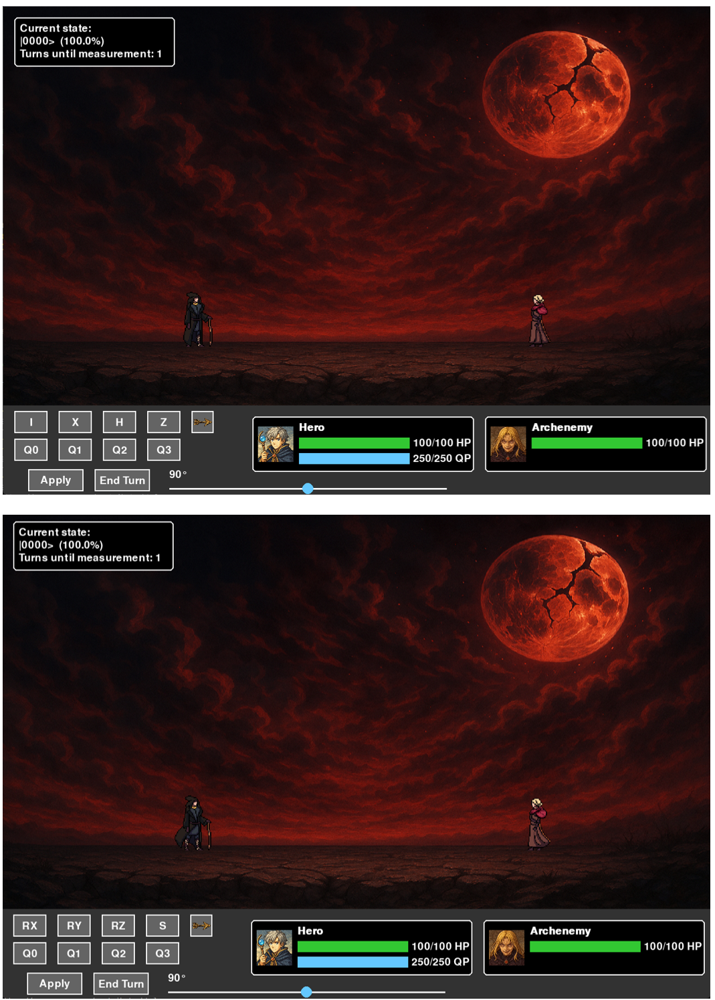

# Quantum-faceoff-superposition-tactics

The game *"Quantum faceoff: superposition tactics"* is developed in the scope of the ADEQUATE (Advanced End-to-end QUAntum computing TEchnical) Course project phase (spring 2025).

The game is an old-school JRPG-style, featuring turn-based combat.

Instead of direct linking to the action, the main idea is to trigger player and enemy actions based on superposition evaluation. Due to the battle linked to a superposition, phenomena of inference and entanglement can be observed during the games, impacting player’s decisions.

The game can serve as an educational tool, allowing one to have a hands-on experience with quantum gate manipulations and their respective effects.

## Table of Contents
- [Dependencies and game launching](#dependencies-and-game-launching)
- [Game structure and gameplay elements](#game-structure-and-gameplay-elements)
- [General “handbook” of in-game skills](#general-handbook-of-in-game-skills)
- [Technical notes](#technical-notes)
- [License and copyrights](#license-and-copyrights)

## Dependencies and game launching

The game was developed and tested using the following setup:

- Python version: **3.12.7**;
- Qiskit version: **1.3.1**. *This is a crucial point. QWorld and ADEQUATE commonly use the 0.43 version of Qiskit, which is generally not directly compatible with 1.0.0+ releases*.
- Qiskit Aer version: **0.15.1**.
- Pygame version: **2.6.1**.

To run the game, run the **main.py** file. 

- Current game version: **1.0.0**.
NB! The game uses a soundtrack. It can be muted/unmuted using the keyboard button **M**.
## Game structure and gameplay elements

The game has mostly a linear structure, featuring two possible endings, and follows the following pattern:

<table border="1" cellspacing="0" cellpadding="6">
  <thead>
    <tr>
      <th colspan="4" style="text-align: center;"><strong>The game structure</strong></th>
    </tr>
    <tr>
      <th>Pre-battle</th>
      <th>Trigger condition</th>
      <th colspan="2">Comments</th>
    </tr>
  </thead>
  <tbody>
    <tr>
      <td>Introduction dialogue</td>
      <td>Game start</td>
      <td colspan="2">
        A dialogue sequence, opening the “final chapter” of the game. Any such dialogue is iterated by pressing the SPACE bar.
        Dialogue is created in such a way that it is implied that there were big events before it, and it is the “final chapter” of the game.
        In that sense, the game is not a short story, but the end of some unknown long story.
      </td>
    </tr>
    <tr>
      <th>Battle phase</th>
      <th>Trigger condition</th>
      <th>Boss</th>
      <th>Player Overall setup</th>
    </tr>
    <tr>
      <td>Stage 1</td>
      <td>From the battle start</td>
      <td>Can apply gates I, X, H.</td>
      <td>
        Can apply I, X, H, Z, RX, RY, RZ, S, T gates. 
        Restores 10 QP each turn. 
        Measurements and state collapse happen after each turn.
      </td>
    </tr>
    <tr>
      <td>In-between dialog</td>
      <td>Transition from stage 1 to stage 2</td>
      <td colspan="2">A dialogue sequence, accompanying the final battle. Triggered in battle. Iterated by pressing the SPACE bar.</td>
    </tr>
    <tr>
      <td>Stage 2</td>
      <td>Boss HP falls below 70% of the max value</td>
      <td>Can apply gates X, H, Z, and CNOT.</td>
      <td>
        X gate is blocked. 
        Can apply I, H, Z, RX, RY, RZ, S, T gates. 
        Restores 10 QP each turn. 
        Measurements and state collapse happen every 2 turns.
      </td>
    </tr>
    <tr>
      <td>In-between dialog</td>
      <td>Transition from stage 2 to stage 3</td>
      <td colspan="2">A dialogue sequence, accompanying the final battle. Triggered in battle. Iterated by pressing the SPACE bar.</td>
    </tr>
    <tr>
      <td>Stage 3</td>
      <td>Boss HP falls below 40% of the max value</td>
      <td>Can apply gates X, H, Z, T, RX, RY, RZ, and CCNOT.</td>
      <td>
        X gate is blocked 
        H gate is blocked 
        Can apply I, Z, RX, RY, RZ, S, T gates. 
        Restores 10 QP each turn. 
        Measurements and state collapse happen every 3 turns.
      </td>
    </tr>
    <tr>
      <th>Post-battle</th>
      <th>Trigger condition</th>
      <th colspan="2">Comments</th>
    </tr>
    <tr>
      <td>Losing dialog</td>
      <td>Player’s HP reached 0</td>
      <td colspan="2">
        Classical approach to “bad ending”. After the dialogue “Game Over” screen is triggered.
        The dialogue is iterated by pressing the SPACE bar.
        After the final screen, use ESC to close the game window.
      </td>
    </tr>
    <tr>
      <td>Winning dialog</td>
      <td>The boss’s HP reached 0</td>
      <td colspan="2">
        “Good ending”. After the dialogue, the “Game Over” screen is triggered.
        Content is different from “bad ending”. The dialogue is iterated by pressing the SPACE bar.
        After the final screen, use ESC to close the game window.
      </td>
    </tr>
  </tbody>
</table>

Any dialog in the box (as in the figure below), can be iterated by pressing the *SPACE* bar.

During the battle, the following controls and information are available to the player (see figure below). The player has information about the current state (superposition), turns until the next measurement happens, knows their own *HP* and *QP*, as well as the enemy’s *HP* (the enemy’s *QP* is infinite, thus not displayed as a bar). The player also has buttons to use via mouse pointer clicks. The top row is used for quantum gates, and the arrow nearby is used to show the next set of quantum gates. Pagination is circular, so the player just needs to press the arrow until the player gets back to the original set of gates.

To apply the gates, the player must select the quantum gate, the qubit, and press the *“Apply”* button. This will immediately display a new state/superposition. In case the player does not have enough *QP*, the message will appear (figure below). The message box can be closed by pressing the *SPACE* bar. In parametric gates (RX, RY, RZ), the value of the angle is selected by the slider. The value on the slider does not affect the rest of the gates.

To end the turn, the player must press *“End Turn”*. Then, the enemy will respond with its set of actions and gate usages. The results of the enemy’s move will be displayed in the info box (can be closed with the *SPACE* bar). For *phase 1*, there will be only **1** gate per turn used by the enemy, in *phase 2* – **2**, and in *phase 3* – **3** (see figure below). The superposition is shown updated, but BEFORE measurement has occurred (so the player can study the new configuration, before it will collapse to one state). 

The actions that were actually done after the measurement was done are displayed on the screen in info boxes under the player/enemy for around 3 seconds and will disappear automatically.

The game continues until one of the sides' *HP* becomes **0**. In any case, it will trigger a good ending or a bad ending with different final dialogues.

After finishing the last dialogue sequence, in both cases will be the end game screen.

## General “handbook” of in-game skills

The two main stats used in the battle system are classical for JRPGs – *HP* (health points), and *QP* (quantum points; the analog of MP). No stat can go over its respective max capacity. Initial stats are shown below:

<table border="1" cellspacing="0" cellpadding="6">
  <thead>
    <tr>
      <th><strong>Stat name</strong></th>
      <th><strong>Basic stat value</strong></th>
    </tr>
  </thead>
  <tbody>
    <tr>
      <td colspan="2" style="text-align: center;"><em>Player</em></td>
    </tr>
    <tr>
      <td>HP (health points)</td>
      <td>100/100</td>
    </tr>
    <tr>
      <td>QP (quantum points)</td>
      <td>250/250</td>
    </tr>
    <tr>
      <td colspan="2" style="text-align: center;"><em>Enemy</em></td>
    </tr>
    <tr>
      <td>HP (health points)</td>
      <td>100/100</td>
    </tr>
    <tr>
      <td>QP (quantum points)</td>
      <td>Infinite</td>
    </tr>
  </tbody>
</table>

The exact action (for both player and enemy) happens after performing a measurement. Measurement is performed automatically each *N* turns (where *N* is a number of the battle phase, ranging from *1* to *3*). Overall, the game setup is represented by a quantum circuit having *4* qubits in the form |*xxyy*⟩. The *xx* part is the player's part, and *yy* part is the enemy’s part of the circuit. As each of them has only 2 qubits, each of them has *22=4* available actions. The linking between actions (attack, defense, etc.) is shown below:

<table border="1" cellspacing="0" cellpadding="6">
  <thead>
    <tr>
      <th><strong>Measurement outcome</strong></th>
      <th><strong>Linked action</strong></th>
      <th><strong>Comment</strong></th>
    </tr>
  </thead>
  <tbody>
    <tr>
      <td colspan="3" style="text-align: center;"><em>Player</em></td>
    </tr>
    <tr>
      <td>|00??&gt;</td>
      <td>Idle</td>
      <td>For the player, it literally does nothing. The least desirable state to observe.</td>
    </tr>
    <tr>
      <td>|01??&gt;</td>
      <td>Attack</td>
      <td>
        Deals the basic value of attack to the enemy, minus the defense modifiers for the enemy (if any).  
        During the first 2 phases of the battle, basic attack is 10; starting from the 3rd phase, basic attack is 20.
      </td>
    </tr>
    <tr>
      <td>|10??&gt;</td>
      <td>Defend</td>
      <td>
        Stacks defense up by 20%. When the enemy hits the player, defense will work, decreasing the damage, and be reset back to 0.
      </td>
    </tr>
    <tr>
      <td>|11??&gt;</td>
      <td>Heal</td>
      <td>Restores 10 HP to the player’s health. Cannot go over the cap.</td>
    </tr>
    <tr>
      <td colspan="3" style="text-align: center;"><em>Enemy</em></td>
    </tr>
    <tr>
      <td>|??00&gt;</td>
      <td>Idle (charge up)</td>
      <td>
        Unlike the player, the enemy will charge up its <em>own</em> attack power when in an idle state by 20% per observing |??00&gt; state. 
        When the enemy <em>deals</em> the damage, the attack bonus is reset to 0.
      </td>
    </tr>
    <tr>
      <td>|??01&gt;</td>
      <td>Attack</td>
      <td>
        Deals the basic value of attack to the player, minus the defense modifiers for the player (if any), plus attack modifiers (if any).  
        Basic attack value for the enemy is changing based on the phase: phase 1 – 10, phase 2 – 15, phase 3 – 20.
      </td>
    </tr>
    <tr>
      <td>|??10&gt;</td>
      <td>Defend</td>
      <td>
        Stacks defense up by 10%. When receiving the damage, the defense will work, decreasing the damage, and be reset back to 0.
      </td>
    </tr>
    <tr>
      <td>|??11&gt;</td>
      <td>Heal</td>
      <td>Restores 10 HP to the enemy’s health. Cannot go over the cap.</td>
    </tr>
    <tr>
      <td colspan="3"><em>?? means that the result on the opponent’s side can be any.</em></td>
    </tr>
  </tbody>
</table>

So, for example, observing the state |*0100*⟩ means that the player’s character is performing an attack (|*01*⟩ part of the state vector), and the enemy is idle (charging up; |*00*⟩ part of the state vector). Currently, 1 shot is used for the evaluation. The leftmost qubit is numbered (index) as *0* for the game, and the rightmost qubit as *3*.

The player can use *any* number of quantum gates per turn to manipulate the state vector, yet the player is limited to their *QP*. The player can apply quantum gates both to their own and the enemy’s qubits. The cost per gate for the player and the list of available gates are shown below:

<table border="1" cellspacing="0" cellpadding="6">
  <thead>
    <tr>
      <th><strong>Quantum gate</strong></th>
      <th><strong>Availability/comment</strong></th>
      <th><strong>Cost in QP</strong></th>
    </tr>
  </thead>
  <tbody>
    <tr>
      <td colspan="3" style="text-align: center;"><em>Player</em></td>
    </tr>
    <tr>
      <td>I</td>
      <td>Available for the whole game</td>
      <td>0</td>
    </tr>
    <tr>
      <td>X</td>
      <td>
        Available for phase 1 and gets blocked after reaching phase 2 of the battle, and stays blocked till the end of the game
      </td>
      <td>10</td>
    </tr>
    <tr>
      <td>H</td>
      <td>
        Available for phases 1 and 2, and gets blocked after reaching phase 3 of the battle, and stays blocked till the end of the game
      </td>
      <td>15</td>
    </tr>
    <tr>
      <td>Z</td>
      <td>Available for the whole game</td>
      <td>6</td>
    </tr>
    <tr>
      <td>S</td>
      <td>Available for the whole game</td>
      <td>6</td>
    </tr>
    <tr>
      <td>T</td>
      <td>Available for the whole game</td>
      <td>6</td>
    </tr>
    <tr>
      <td>RX</td>
      <td>
        Available for the whole game. 
        The allowed angle to use in parametrization is from 0 to π. The cost of any rotation gate is scalable – the bigger the angle used, the higher the cost in QP is.
        Minimal cost is 1. 0 rotation cost 0 (as it is basically I).
      </td>
      <td>Min cost: 1. Max cost: 30</td>
    </tr>
    <tr>
      <td>RY</td>
      <td>
        Available for the whole game. 
        The allowed angle to use in parametrization is from 0 to π. The cost of any rotation gate is scalable – the bigger the angle used, the higher the cost in QP is.  Minimal cost is 1. 0 rotation cost 0 (as it is basically I).
      </td>
      <td>Min cost: 1. Max cost: 30</td>
    </tr>
    <tr>
      <td>RZ</td>
      <td>
        Available for the whole game. 
        The allowed angle to use in parametrization is from 0 to π. The cost of any rotation gate is scalable – the bigger the angle used, the higher the cost in QP is. Minimal cost is 1. 0 rotation cost 0 (as it is basically I).
      </td>
      <td>Min cost: 1. Max cost: 30</td>
    </tr>
  </tbody>
</table>

The enemy’s AI is following a probabilistic pattern in selecting the gates, depending on the phase:

<table border="1" cellspacing="0" cellpadding="6">
  <thead>
    <tr>
      <th>Battle phase</th>
      <th>Available gates</th>
      <th>Comments</th>
    </tr>
  </thead>
  <tbody>
    <tr>
      <td colspan="3" style="text-align:center;"><em>Enemy</em></td>
    </tr>
    <tr>
      <td>1</td>
      <td>I, X, H</td>
      <td>
        The enemy will use only 1 gate per turn.  
        The enemy will target their own qubits with 60% of probability. The enemy will uniformly randomly pick one of its own qubits and, with 75% probability, apply X to it, and with 25% probability, apply I to it. 
        So, the enemy can use only I, X on their own qubits.  
        With the remaining 40%, the enemy will target the player’s qubits. The enemy will uniformly randomly pick one of the player’s qubits and, with 80% probability, apply H to one of them, and with 20% probability, apply X to it. 
        So, the enemy can use only X, H on their player’s qubits.
      </td>
    </tr>
    <tr>
      <td>2</td>
      <td>X, H, Z, CNOT</td>
      <td>
        The enemy will use only 2 gates per turn sequentially.  
        I gate is no longer used by the enemy. Selection between own and the player’s qubits is now purely uniform (50/50). 
        With a 25% chance, the enemy will use a CNOT gate. The selection between player/enemy qubits is uniformly random, yet always will have control and target on the opposite sides (if control for the enemy, target for the player, and vice versa). Moreover, CNOT can be used by the enemy only once per turn.  
        The rest of the gates are picked with 75% probability, and within it, X and H will be used with 40% chance each, and Z will be used with 20% probability.
      </td>
    </tr>
    <tr>
      <td>3</td>
      <td>X, H, Z, T, RX, RY, RZ and CCNOT</td>
      <td>
        The enemy will use only 2 gates per turn sequentially.  
        I gate is no longer used by the enemy. Selection between own and the player’s qubits is now purely uniform (50/50). 
        With a 25% chance, the enemy will use a CNOT gate. The selection between player/enemy qubits is uniformly random, yet always will have control and target on the opposite sides (if control for the enemy, target for the player, and vice versa). Moreover, CNOT can be used by the enemy only once per turn.  
        The rest of the gates are picked with 75% probability, and within it, X and H will be used with 40% chance each, and Z will be used with 20% probability.
      </td>
    </tr>
  </tbody>
</table>

The following controls are used in the game:
- **SPACE** bar – iterating through the dialogue sequences; closing in-battle notifications (actions done by the enemy).
- **Mouse** – gates/qubits selection and applications.
- **M** button – mute/unmute soundtrack.

## Technical notes

The game structure includes 8 *.py* files and loadable assets in the assets folder.
- **main.py** – the pygame initialization and main loop with game phase selections are located there. This is the file that starts the game.
- **assets.py** – setting up loadable assets (sprites, images, music).
- **constants.py** – serves as a global “warehouse” for variables (not only constants) to ease access both from main and corresponding files with functions.
- **dialogs.py** – stores all labeled dialogs that appear in dialog boxes. Store the name of a speaking character and the text contents. If no name is written - narration, action description.
- **game_constants.py** – stores information about character and enemy stats and actions.
- **quantum.py** – uses qiskit, deals with setting up the quantum state, measuring, and getting a statevector. The core of the battle system.
- **game_logic.py** – has all functions used to get/process/output the result of the player’s actions and logic for the enemy AI.
- **ui.py** – all functions that are rendering parts of UI (dialog boxes, char stats, superposition, action buttons, sprites animation, etc.).

The rest of the technical and implementational comments are in the source code.

## License and copyrights

The code and the whole game concept are developed by me and belong to me. The images of icons, characters portrays and backgrounds are generated by ChatGPT specifically for this game. 

Character sprites were taken from https://craftpix.net/freebies/free-wizard-sprite-sheets-pixel-art/. They are going under royalty-free usage in unlimited projects, and fully attributed to https://craftpix.net/. 

Musical compositions are created using an AI model, and the lyrics used are original.

The short story, characters, and dialogues are created by me and are purely a work of fiction.

This project is licensed under the **Creative Commons Attribution-NonCommercial-NoDerivatives 4.0 International** (CC BY-NC-ND 4.0).
